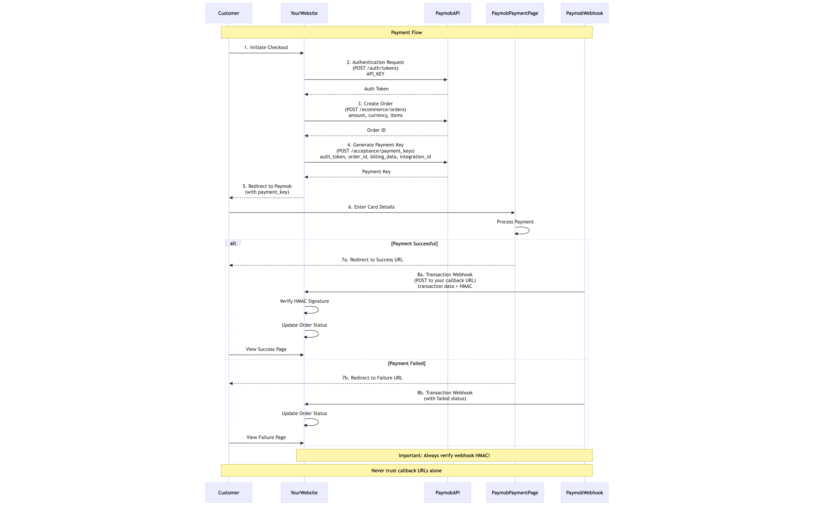

# Paymob Payment Gateway Integration Guide

A comprehensive guide for integrating Paymob payment gateway into your application, covering payment processing, refunds, webhooks, and best practices.

## Table of Contents

- [Overview](#overview)
- [Prerequisites](#prerequisites)
- [Payment Flow](#payment-flow)
- [Step-by-Step Integration](#step-by-step-integration)

## Overview

Paymob is a leading payment gateway in the Middle East and North Africa (MENA) region. This guide provides practical examples and explanations for integrating Paymob's payment services.

### What This Guide Covers

- Complete payment flow with sequence diagrams
- Authentication and order creation
- Payment key generation
- Webhook verification using HMAC
- Refund processing
- Error handling
- Security best practices

## 📦 Prerequisites

Before starting, you need:

### Paymob Account
Sign up at Paymob Dashboard and complete merchant verification.

### API Credentials
You'll need three main credentials:
- **API Key** - Used for authentication
- **Integration ID** - Different for each payment method (card, wallet, etc.)
- **HMAC Secret** - Used for webhook verification

### Development Environment
- Your preferred programming language
- HTTPS endpoint for webhooks (required in production)
- Database to store order information

## Payment Flow

The Paymob integration follows this sequence:

Customer visits your website → Your server calls Paymob API → Customer redirects to Paymob → Customer completes payment → Paymob sends webhook to your server → You verify and update order status

### Key Steps Overview

**Authentication** - Get auth token using your API key

**Create Order** - Register order details with Paymob

**Generate Payment Key** - Create unique payment token with billing information

**Redirect Customer** - Send customer to Paymob's payment page

**Process Payment** - Customer enters card details and completes payment

**Webhook Callback** - Paymob notifies your server about the transaction

**Verify and Update** - Verify HMAC signature and update order status in your database

## Step-by-Step Integration

### Step 1: Authentication

Get an authentication token using your API key.

**API Endpoint:** POST to authentication endpoint

**What to send:** Your API key

**What you receive:** An authentication token that expires after a certain time

**Important:** This token is used for all subsequent API calls. Store it temporarily but never save it permanently.

See folder: `/examples/authentication/`

---

### Step 2: Create Order

Register the order with Paymob before accepting payment.

**API Endpoint:** POST to create order endpoint

**What to send:**
- Auth token from Step 1
- Delivery needed flag (true/false)
- Amount in cents (multiply your amount by 100)
- Currency code (EGP, USD, SAR, etc.)
- List of items with name, amount, description, and quantity

**What you receive:** 
- Order ID - Store this in your database linked to your own order record

**Critical Notes:**
- Amount must be in cents, not full currency units. Example: 100.00 EGP should be sent as 10000 cents
- The Order ID returned is essential for tracking and refunds
- Create the order in YOUR database first with "pending" status, then create it in Paymob

See folder: `/examples/create-order/`

---

### Step 3: Generate Payment Key

Create a payment key that contains all order and customer billing information.

**API Endpoint:** POST to payment keys endpoint

**What to send:**
- Auth token from Step 1
- Amount in cents (must match the order amount)
- Expiration time in seconds (typically 3600 for 1 hour)
- Order ID from Step 2
- Billing data object with all customer information
- Currency code
- Integration ID for your payment method

**Billing Data Fields (all required):**
All these fields must be provided. If a field doesn't apply to your case, use "NA" as the value:
- Email address
- First name and last name
- Phone number with country code (example: +201234567890)
- Apartment, floor, building, street
- City, state, country
- Postal code
- Shipping method

**What you receive:** 
- Payment token - A unique token used to redirect the customer

**Important Notes:**
- The integration ID is different for each payment method (credit card, wallet, installments, etc.)
- Find your integration IDs in the Paymob dashboard
- The payment key expires, so generate it right before redirecting the customer

See folder: `/examples/payment-key/`

---

### Step 4: Redirect to Payment Page

Send the customer to Paymob's secure payment page.

**Redirect URL Format:**
Use the iframe URL with your iframe ID and the payment token from Step 3

**Two Options:**

**Full Page Redirect:** Redirect the customer's browser to the Paymob URL. They'll see Paymob's payment page, complete payment, then return to your success or failure URL.

**Embedded Iframe:** Display the Paymob payment page within your website using an iframe element. This provides a more seamless experience.

**What the customer sees:**
A secure payment form where they enter their card details, complete 3D Secure verification if required, and see confirmation or error messages.

See folder: `/examples/redirect/`

---

## Webhook Handling

**CRITICAL: Webhooks are the ONLY reliable way to confirm payment status.**

### Why Webhooks Matter

Never rely solely on the callback URL redirect. Here's why:

**Customer can close browser** - They might close the tab before the redirect happens

**URLs can be manipulated** - Someone could manually visit your success URL without paying

**Network issues** - Internet problems might prevent the redirect from completing

**Race conditions** - The webhook often arrives before the browser redirect

**Webhooks are guaranteed** - Paymob will retry sending webhooks until you respond with 200 OK

### How Webhooks Work

After payment processing (success or failure), Paymob sends an HTTP POST request to your webhook URL with complete transaction details.

**Your webhook endpoint must:**
- Be publicly accessible on the internet
- Use HTTPS in production (HTTP works in testing)
- Respond with HTTP 200 status quickly (within a few seconds)
- Process the webhook asynchronously if needed
- Return 200 even if you've already processed this transaction

### Webhook Data Structure

Paymob sends transaction information including:
- Transaction ID
- Success status (true/false)
- Amount in cents
- Currency
- Order ID (the one you created in Step 2)
- Payment method details
- Timestamp
- HMAC signature for verification

### HMAC Verification (MANDATORY)

**HMAC (Hash-based Message Authentication Code)** proves the webhook actually came from Paymob and wasn't forged.

**How HMAC Works:**

Paymob takes specific fields from the transaction data, concatenates them in a specific order, then creates a cryptographic hash using your HMAC secret. This hash is included in the webhook.

You must do the same calculation on your server and verify the hashes match.

**Fields to Concatenate (in exact order):**

Take these fields from the transaction object and concatenate them as strings without any separators:
- amount_cents
- created_at
- currency
- error_occured (yes, it's misspelled in Paymob's system)
- has_parent_transaction
- id
- integration_id
- is_3d_secure
- is_auth
- is_capture
- is_refunded
- is_standalone_payment
- is_voided
- order.id (note the nested field)
- owner
- pending
- source_data.pan
- source_data.sub_type
- source_data.type
- success

**Verification Process:**

Take the concatenated string and calculate an HMAC-SHA512 hash using your HMAC secret. Compare this calculated hash with the hmac value sent in the webhook. They must match exactly.

Use a constant-time comparison function to prevent timing attacks.

**NEVER EVER process a payment without verifying the HMAC signature first!** This is the only thing protecting you from fraudulent payment confirmations.

See folder: `/examples/webhook-verification/`
